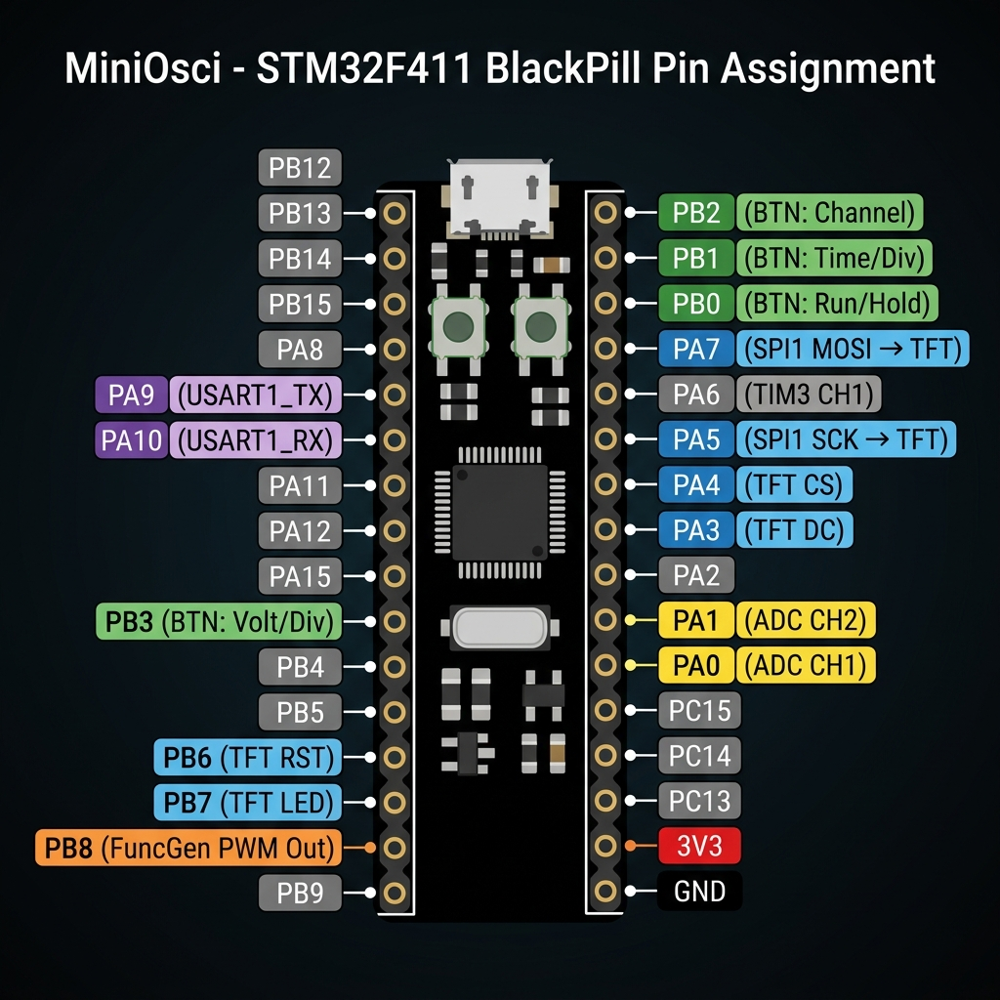
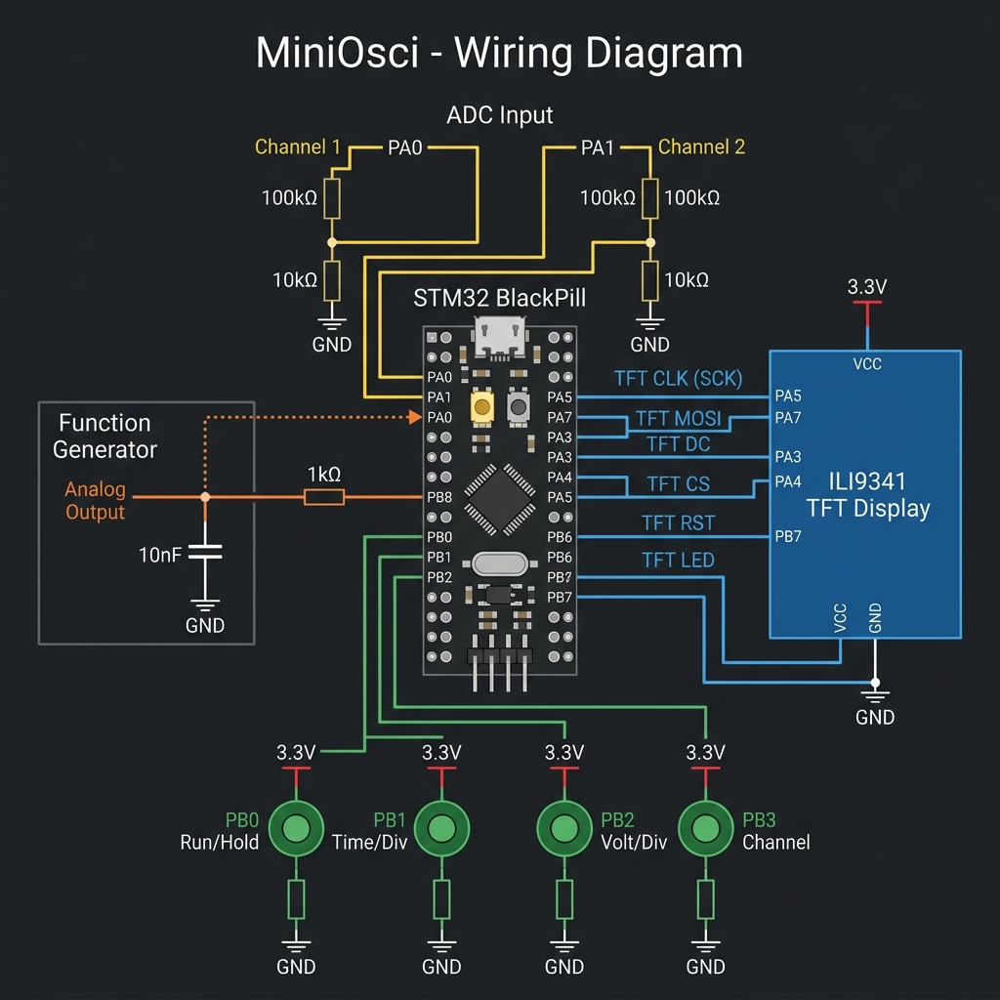

# MiniOsci — Technical Documentation

> **Dual-Channel Oscilloscope + Function Generator**
> STM32F411CEU6 (BlackPill) | ILI9341 TFT | HAL + CubeMX

---

## Table of Contents

1. [System Overview](#system-overview)
2. [Pin Diagram](#pin-diagram)
3. [Wiring Diagram](#wiring-diagram)
4. [Detailed Pin Mapping](#detailed-pin-mapping)
5. [Peripheral Configuration](#peripheral-configuration)
6. [Software Architecture](#software-architecture)
7. [Signal Flow](#signal-flow)
8. [Function Generator Design](#function-generator-design)
9. [Display Layout](#display-layout)
10. [Specifications](#specifications)

---

## System Overview

MiniOsci is a portable dual-channel oscilloscope with a built-in PWM function generator. It samples analog signals using DMA-driven ADC, processes them in real-time (frequency measurement, Vpp calculation, trigger detection), and renders waveforms on a 2.8" TFT display.

### Block Diagram

```
                                ┌──────────────────────────────────────┐
                                │          STM32F411CEU6               │
 ┌─────────┐                    │                                      │
 │ Analog   │──► Voltage ──────►│ PA0 (ADC1_CH0) ──┐                   │
 │ Input 1  │    Divider        │ PA1 (ADC1_CH1) ──┤                   │
 │ Analog   │──► Voltage ──────►│                   │                   │      ┌───────────┐
 │ Input 2  │    Divider        │    ADC1 ◄── TIM2  │                   │      │  ILI9341  │
 └─────────┘                    │     │    (TRGO)    │                   │      │  240×320  │
                                │     ▼              │    SPI1 ─────────┼─────►│   TFT     │
                                │    DMA2    Main    │    PA5 (SCK)     │      │  Display  │
                                │     │      Loop    │    PA7 (MOSI)    │      │           │
                                │     ▼       │      │    PA3 (DC)      │      └───────────┘
                                │  Buffer ───►├─────►│    PA4 (CS)      │
                                │  [512]      │      │    PB6 (RST)     │
                                │        Signal      │    PB7 (LED)     │
                                │        Process     │                   │
 ┌────────────┐                 │                    │                   │
 │  Buttons   │                 │                    │                   │
 │ PB0: Mode  │────── EXTI ────►│  UI State Machine  │                   │
 │ PB1: T/Div │                 │                    │                   │
 │ PB2: V/Div │                 │                    │                   │
 │ PB3: Chan  │                 │    TIM5 ──► TIM4  │                   │
 └────────────┘                 │   (step)   (PWM)  │                   │
                                │              │     │                   │
                                │              ▼     │                   │
                                │           PB8 ─────┼──► RC Filter ──► Analog Out
                                └──────────────────────────────────────┘
```

---

## Pin Diagram



### Pin Color Legend

| Color | Function |
|-------|----------|
| 🟡 Yellow | ADC analog inputs (PA0, PA1) |
| 🔵 Blue | SPI / TFT display (PA3, PA4, PA5, PA7, PB6, PB7) |
| 🟢 Green | Push buttons with EXTI (PB0, PB1, PB2, PB3) |
| 🟠 Orange | Function generator PWM output (PB8) |
| 🟣 Purple | UART debug (PA9, PA10) |
| ⚪ Gray | Unused / available |

---

## Wiring Diagram



---

## Detailed Pin Mapping

### ADC Inputs (Analog)

| Pin | Function | Notes |
|-----|----------|-------|
| PA0 | ADC1 Channel 0 (CH1) | Through 1:11 voltage divider (100kΩ + 10kΩ) |
| PA1 | ADC1 Channel 1 (CH2) | Through 1:11 voltage divider (100kΩ + 10kΩ) |

**Max input voltage**: 3.3V × 11 = **36.3V** (with divider)
**ADC resolution**: 12-bit (0–4095)
**Sampling**: 15 cycles, dual-channel scan mode

### TFT Display (SPI1)

| Pin | Function | Notes |
|-----|----------|-------|
| PA5 | SPI1_SCK | Clock, 50 MHz |
| PA7 | SPI1_MOSI | Data out (TX only, no MISO needed) |
| PA3 | GPIO Output | DC — Data/Command select |
| PA4 | GPIO Output | CS — Chip select (active low) |
| PB6 | GPIO Output | RST — Hardware reset |
| PB7 | GPIO Output | LED — Backlight control |

### Push Buttons (EXTI)

| Pin | Function | EXTI | Debounce |
|-----|----------|------|----------|
| PB0 | Run / Hold | EXTI0, Priority 3 | 200ms software |
| PB1 | Time/Div cycle | EXTI1, Priority 3 | 200ms software |
| PB2 | Volt/Div cycle | EXTI2, Priority 3 | 200ms software |
| PB3 | Channel select | EXTI3, Priority 3 | 200ms software |

**Trigger**: Rising edge
**Pull**: External pull-down resistors recommended

### Function Generator (TIM4 PWM)

| Pin | Function | Notes |
|-----|----------|-------|
| PB8 | TIM4_CH3 (AF2) | PWM output, ~390 kHz carrier |

**External components**: 1kΩ series resistor + 10nF capacitor to GND (RC filter, fc ≈ 16 kHz)

### UART Debug (USART1)

| Pin | Function | Notes |
|-----|----------|-------|
| PA9 | USART1_TX | Debug output |
| PA10 | USART1_RX | Debug input |

### Other

| Pin | Function |
|-----|----------|
| PA6 | TIM3_CH1 — Input capture (frequency measurement) |
| PH0 | HSE oscillator input (25 MHz crystal) |
| PH1 | HSE oscillator output |

---

## Peripheral Configuration

### Clock Tree

```
HSE (25 MHz) → PLL (M=25, N=200, P=2) → SYSCLK = 100 MHz
                                        → AHB = 100 MHz
                                        → APB1 = 50 MHz (timers: 100 MHz)
                                        → APB2 = 100 MHz
```

### Timer Summary

| Timer | Purpose | PSC | ARR | Frequency | Interrupt |
|-------|---------|-----|-----|-----------|-----------|
| TIM2 | ADC trigger (TRGO) | 0 | 999 (adjustable) | 100 kHz default | No |
| TIM3 | Input capture (CH1) | 0 | 65535 | N/A | No |
| TIM4 | FuncGen PWM (CH3) | 0 | 255 | ~390 kHz | No |
| TIM5 | FuncGen step timer | 0 | 1562 (adjustable) | 64 kHz default | Yes (Priority 2) |

### ADC Configuration

| Setting | Value |
|---------|-------|
| Resolution | 12-bit |
| Scan mode | Enabled (2 channels) |
| External trigger | TIM2 TRGO (Update) |
| DMA | Circular, half-word, DMA2 Stream 0 |
| Buffer size | 512 (256 samples × 2 channels, interleaved) |
| Sampling time | 15 cycles per channel |
| Analog watchdog | Enabled, threshold 3700/4095 |

### NVIC Priority Summary

| IRQ | Priority | Purpose |
|-----|----------|---------|
| DMA2_Stream0 | 0 | ADC DMA transfer |
| ADC1 | 0 | Analog watchdog |
| TIM5 | 2 | Function generator stepping |
| EXTI0–EXTI3 | 3 | Button presses |
| SysTick | 15 | HAL timebase (1 ms) |

---

## Software Architecture

### Module Overview

```
┌─────────────────────────────────────────────────────────┐
│                      main.c                              │
│                (init + main loop)                         │
└────────┬──────────┬──────────┬──────────┬───────────────┘
         │          │          │          │
    ┌────▼───┐ ┌────▼───┐ ┌───▼────┐ ┌───▼──────┐
    │osc_adc │ │osc_sig │ │osc_disp│ │ osc_ui   │
    │  .c/.h │ │nal.c/.h│ │lay.c/.h│ │   .c/.h  │
    └────┬───┘ └────────┘ └───┬────┘ └──────────┘
         │                     │
    ┌────▼───┐            ┌───▼────┐    ┌──────────┐
    │ adc.c  │            │ili9341 │    │ func_gen │
    │ dma.c  │            │  .c/.h │    │   .c/.h  │
    │ tim.c  │            └────────┘    └──────────┘
    └────────┘
      HAL / CubeMX generated
```

### Module Responsibilities

| Module | File(s) | Responsibility |
|--------|---------|----------------|
| **osc_adc** | `osc_adc.c/h` | ADC start/stop, DMA buffer management, de-interleaving CH1/CH2 |
| **osc_signal** | `osc_signal.c/h` | Frequency calculation (zero-crossing), Vpp, Vmin, Vmax, trigger detection, pixel mapping |
| **osc_display** | `osc_display.c/h` | Grid rendering, waveform drawing, measurement bar, FG status display |
| **osc_ui** | `osc_ui.c/h` | Button handler, state machine (Run/Hold), time/volt div cycling, channel selection |
| **func_gen** | `func_gen.c/h` | Waveform LUTs, PWM duty cycle stepping, frequency control |
| **ili9341** | `ili9341.c/h` | Low-level TFT driver (SPI commands, pixel/rect/line/string drawing) |
| **config** | `config.h` | All compile-time constants (colors, dimensions, divider values) |

---

## Signal Flow

### ADC Sampling Pipeline

```
1. TIM2 Update Event (TRGO)
   ↓
2. ADC1 starts conversion (CH0 → CH1 scan)
   ↓
3. DMA2 Stream0 transfers result to adcRawBuffer[512]
   (circular mode, interleaved: [CH0, CH1, CH0, CH1, ...])
   ↓
4. DMA Transfer Complete callback → sets bufferReady = 1
   ↓
5. Main loop detects bufferReady:
   a. De-interleave into ch1Buffer[256] and ch2Buffer[256]
   b. Find trigger point (rising edge crossing midpoint)
   c. Calculate frequency (zero-crossing counting)
   d. Calculate Vpp (max - min)
   e. Map ADC values to screen pixels
   f. Draw waveform + measurements on TFT
```

### Function Generator Pipeline

```
1. TIM5 Update Interrupt (64 × output_freq Hz)
   ↓
2. ISR reads activeLUT[lutIndex] → writes to TIM4->CCR3
   ↓
3. lutIndex increments (wraps at 64)
   ↓
4. TIM4 outputs PWM on PB8 with updated duty cycle
   ↓
5. External RC filter (1kΩ + 10nF) smooths PWM → analog
```

---

## Function Generator Design

### PWM Approach

Since the STM32F411 has **no DAC**, analog output is achieved by rapidly varying PWM duty cycle through a waveform lookup table and filtering with an external RC circuit.

### Lookup Tables

Each waveform is stored as a 64-sample, 8-bit (0–255) array:

| Waveform | Pattern |
|----------|---------|
| **Sine** | `sin(2π × i/64)` mapped to 0–255 |
| **Square** | First 32 samples = 255, last 32 = 0 |
| **Triangle** | Linear ramp 0→255 (32 samples), then 255→0 (32 samples) |
| **Sawtooth** | Linear ramp 0→255 over 64 samples |

### Frequency Control

Output frequency = `TIM_CLOCK / ((TIM5_ARR + 1) × LUT_SIZE)`

| Target Freq | TIM5 ARR | Step Rate |
|-------------|----------|-----------|
| 100 Hz | 15624 | 6,400 Hz |
| 500 Hz | 3124 | 32,000 Hz |
| 1 kHz | 1562 | 64,000 Hz |
| 2 kHz | 780 | 128,000 Hz |
| 5 kHz | 311 | 320,000 Hz |
| 10 kHz | 155 | 640,000 Hz |

### RC Filter Design

```
PB8 ──[ 1kΩ ]──┬── Output
               [10nF]
                │
               GND

Cutoff: fc = 1 / (2π × 1kΩ × 10nF) ≈ 15.9 kHz
```

- Passes all waveform frequencies (100 Hz – 10 kHz) cleanly
- Attenuates the 390 kHz PWM carrier by ~28 dB

---

## Display Layout

```
┌──────────────────────────── 240px ────────────────────────────┐
│  CH1  │  1.2kHz  │                         │  Vpp:2.45V       │ ← Top bar (20px)
├───────┴──────────┴─────────────────────────┴──────────────────┤
│                                                                │
│  · · · · · · · · ·│· · · · · · · · ·     Dotted grid          │
│                    │                       8×6 divisions       │
│  ─ ─ ─ ─ ─ ─ ─ ─ ─┼─ ─ ─ ─ ─ ─ ─ ─ ─   Center crosshair   │
│                    │                                           │
│         ∿∿∿∿∿∿     │    ∿∿∿∿∿∿            Waveform area      │
│       ∿∿      ∿∿   │  ∿∿      ∿∿          (240 × 270px)      │
│      ∿          ∿  │ ∿          ∿                              │
│     ∿            ∿ │∿            ∿                             │
│                    │                                           │
│  · · · · · · · · ·│· · · · · · · · ·                          │
│                    │                                           │
├────────────────────┴──────────────────────────────────────────┤
│  T:100us  │  V:1V  │                    │  RUN                │ ← Bottom row 1
│  FG:SIN 1kHz                                                  │ ← Bottom row 2 (orange)
└───────────────────────────────────────────────── 320px ───────┘
```

### Color Scheme (RGB565)

| Element | Color | Hex |
|---------|-------|-----|
| Background | Black | 0x0000 |
| Channel 1 waveform | Yellow | 0xFFE0 |
| Channel 2 waveform | Cyan | 0x07FF |
| Grid lines | Dark gray | 0x4208 |
| Center crosshair | Dark green | 0x03E0 |
| Text | White | 0xFFFF |
| FG status | Orange | 0xFD20 |
| HOLD indicator | Red | 0xF800 |
| RUN indicator | Green | 0x07E0 |

---

## Specifications

| Parameter | Value |
|-----------|-------|
| MCU | STM32F411CEU6 (Cortex-M4F, 100 MHz) |
| ADC | 12-bit, dual-channel, DMA circular |
| Max sample rate | ~100 kSPS per channel |
| Display | ILI9341, 240×320, SPI 50 MHz |
| Time divisions | 10µs, 20µs, 50µs, 100µs, 200µs, 500µs, 1ms |
| Voltage divisions | 0.5V, 1V, 2V, 5V |
| Input range | 0–36.3V (with 1:11 divider) |
| FuncGen waveforms | Sine, Square, Triangle, Sawtooth |
| FuncGen frequency | 100 Hz – 10 kHz |
| FuncGen resolution | 8-bit (64 samples/period) |
| Power supply | USB 5V (via BlackPill) |
| Flash usage | ~64 KB (estimated) |
| RAM usage | ~12 KB (estimated) |
